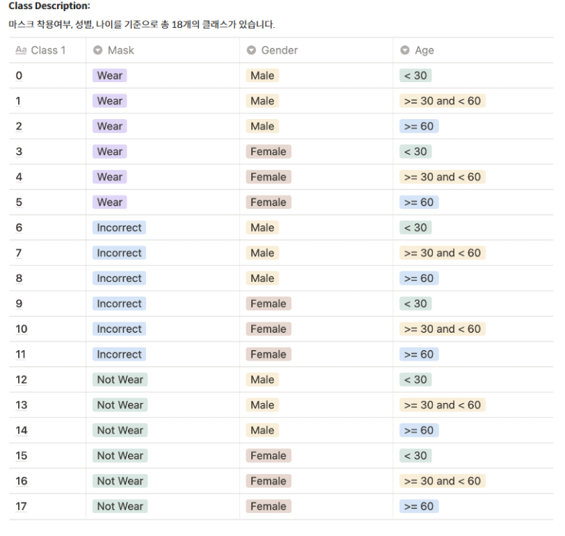

# Image Classification Contest

## 프로젝트 개요

### 프로젝트 주제
<blockquote>
COVID-19 확산 방지를 위해 중요한 것은 올바른 마스크 착용이다. 
이를 검사하는 인적자원을 최소화하기 위해 카메라에 비춰진 얼굴 이미지 만으로 마스크를 쓰고 있는지, 쓰지 않았는지, 정확히 쓴 것이 맞는지 
Image Classification 기반으로 구분할 수 있는 시스템을 구축하려고 한다.
</blockquote>

### 데이터셋 구성
- 아시아인 남녀로 구성되었다.
- 연령대는 20대부터 70대까지 다양하게 분포하고 있다.
- 전체 4500명 = train set 2700명 (60%) + test set 1800명 (40%)
- 한 명당 7장 = no mask 1장 + incorrect mask 1장 + correct mask 5장
- 한 장당 512*384의 사이즈를 가진다.
- 현재 task에서의 class

    

### 개발환경
- Ubuntu 18.04.5 LTS
- Intel(R) Xeon(R) Gold 5120 CPU @ 2.20GHz
- Ram 90GB
- Tesla V100 32GB

## 프로젝트 팀 구성 및 역할
- 박정훈 
    - [iksadNorth](./iksadNorth/)
    - confusion matrix 사용한 실험 결과 시각화 구현
    - 중복되는 Mask data undersampling 구현
- 김인정 
    - [ijkimmy](./ijkimmy/)
    - 모델 학습 및 성능 비교 (VGGFace, ImageNet 모델들)
    - RandomWeightedSampler, WeightedCrossEntropyLoss, StratifiedKFold, Early Stopping, Ensemble (hard, soft voting) 구현
- 진상우 
    - [Jin](./Jin/)
    - ViT 기반 모델 & optimizer (Adam, AdamW) 실험
- 김진우 
    - [jinu](./jinu/)
    - wandb sweep 사용한 hyperparameter tuning 실험
- 서정빈
    - [jeongbeen](./jeongbeen/)
    - EDA를 통한 Feature Engineering
    - 모델 실험: 단일 모델로 18개 클래스 한 번에 분류하기 (AlexNet) vs. 카테고리(마스크, 성별, 연령대)별 모델 3개의 결과를 합치기 (ResNet18, ResNet50)
    - 위 모델에 대한 Hyperparameter Tuning

## Ground Rule
- 원활한 의사소통을 위해 Slack과 Zoom을 활용
- 실험 공유: Tensorboard와 WandB를 활용
